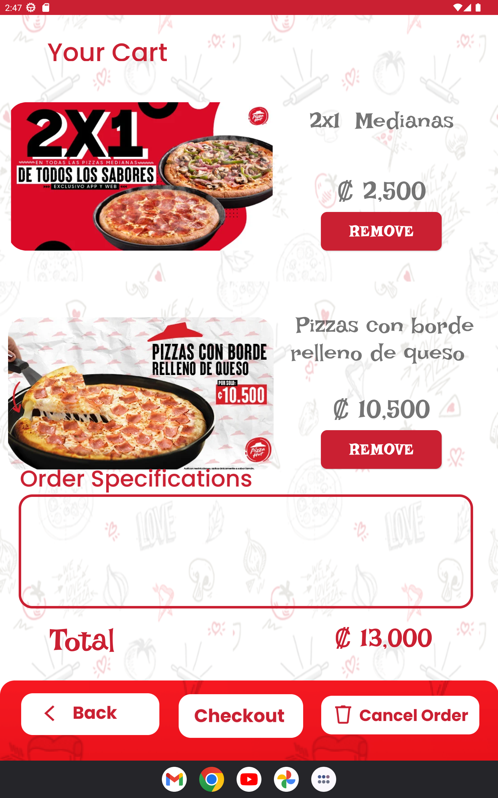
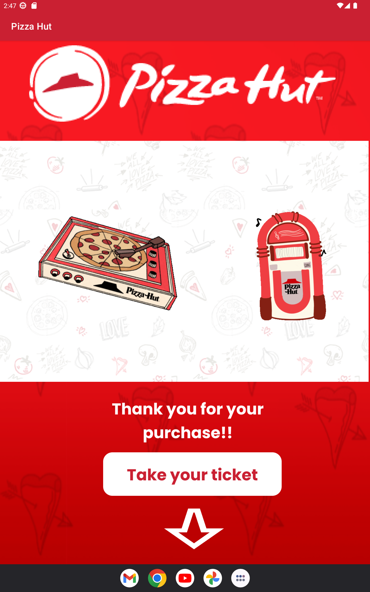

# Pizza Hut App

This is a calculator project developed in Kotlin in Android Studio for the Programming III class at the university. The user interface is inspired by the iconic video game character Pacman and the game itself.

## Features

The calculator includes the following features:

- Addition
- Subtraction
- Multiplication
- Division
- Exponentiation
- Square Root

## How to use the calculator

1. Clone the repository to your computer.
2. Open the project in Android Studio.
3. Run the project on a virtual device or on an Android device connected to your computer.
4. Use the user interface to perform your calculations.

## Supported Screen Sizes

This calculator has been designed and optimized for devices with screens similar in size to the Google Pixel 6 Pro. While it may work on other devices, the user interface may not display correctly or be difficult to use.

## Credits

- Developed by Luis C.

## License

This project is licensed under the MIT License - see the `LICENSE` file for details.
