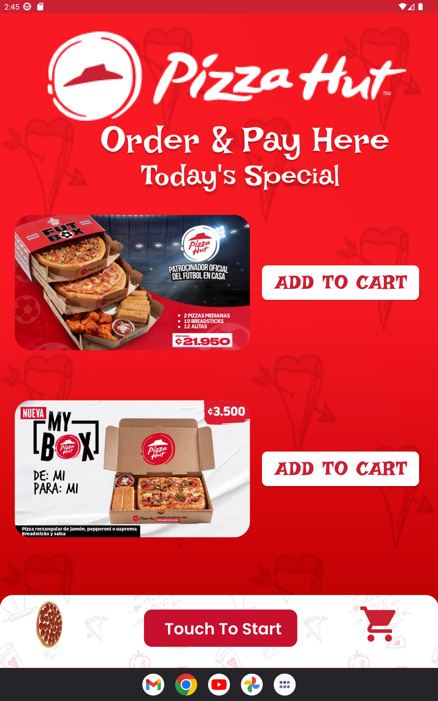
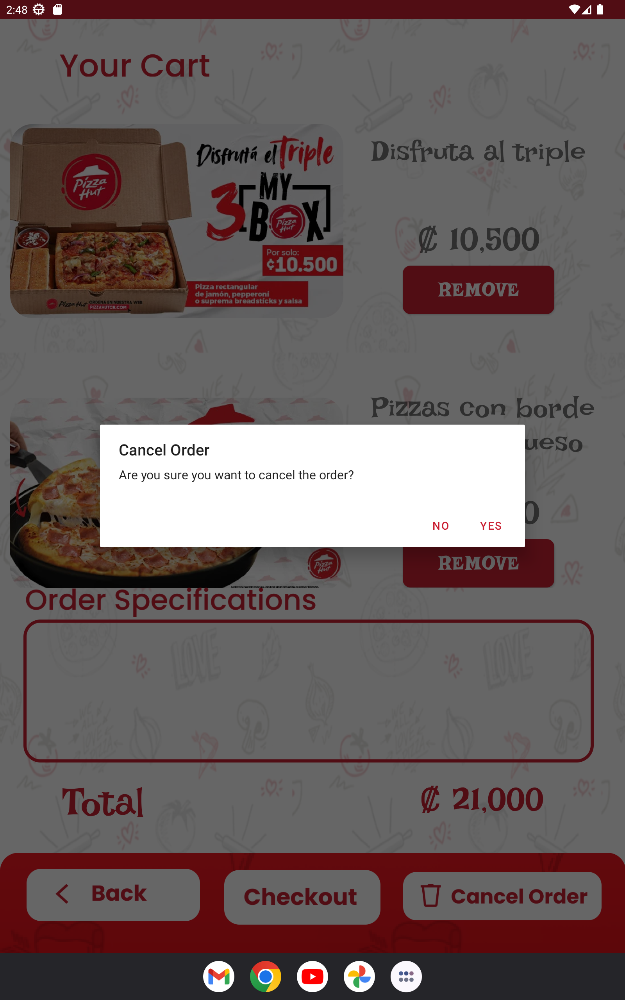

# Pizza Hut App

Welcome to Pizza Hut App! This is a mobile application developed project developed in Java in Android Studio for the Programming III class at the university for ordering pizzas from Pizza Hut. It provides a user-friendly interface to browse through the menu, customize pizzas, and place orders conveniently.


| Screenshot 1: Loading Screen | Screenshot 2: Home Screen |
|--------------|--------------|
|       |       |
| Screenshot 3: Loading Screen | Screenshot 4: Home Screen |
|--------------|--------------|
|       |       |
| Screenshot 5: Loading Screen | Screenshot 6: Home Screen |
|--------------|--------------|
|       |       |


## Features

The Pizza Hut App includes the following features:

- Browse through the menu: View the available pizzas and their descriptions.
- Customization options: Customize your pizzas with various toppings, crust types, and sizes.
- Place orders: Add pizzas to your cart and complete the order process.
- User authentication: Create an account, log in, and manage your profile information.


## How to use the calculator

1. Clone the repository to your local machine using the following command:

   ```bash
   git clone https://github.com/luisc68/pizza_hut_app.git


2. Open the project in Android Studio.
3. Run the project on a virtual device or on an Android device connected to your computer.
4. Use the user interface to perform your calculations.

## Supported Screen Sizes

This app has been designed and optimized for devices with screens similar in size to the Google Nexus 10. While it may work on other devices, the user interface may not display correctly or be difficult to use.

## Credits

- Developed by Luis C.

## Contact

If you have any questions or suggestions, feel free to reach out:

- Email: cernajose79@gmail.com
- Twitter: [@05_joseluis](https://twitter.com/05_joseluis)

Enjoy ordering delicious pizzas with Pizza Hut App!

## License

This project is licensed under the MIT License - see the `LICENSE` file for details.
